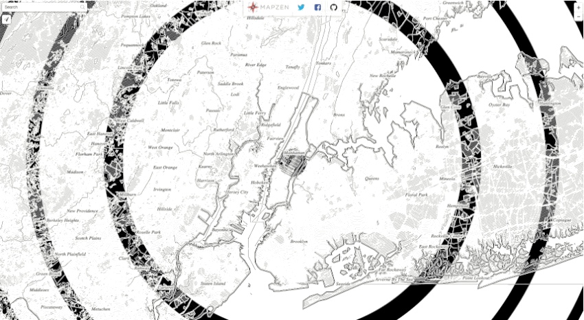
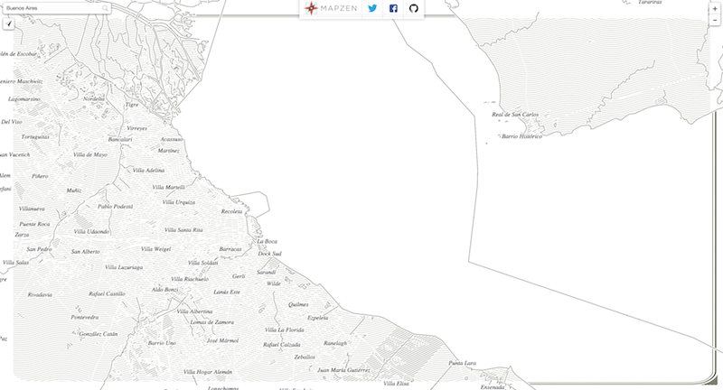
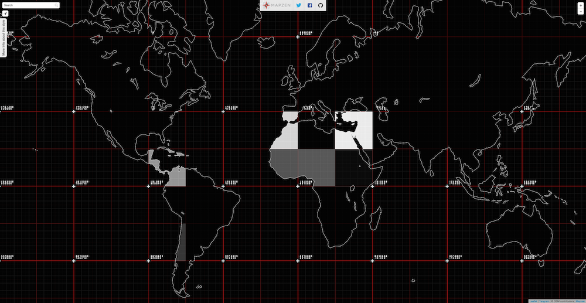
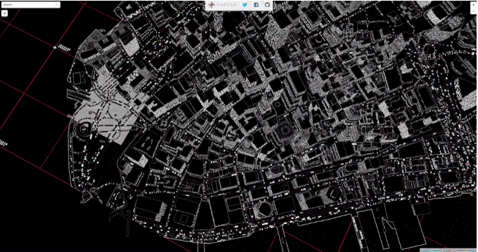
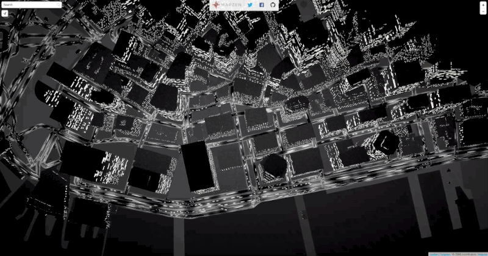
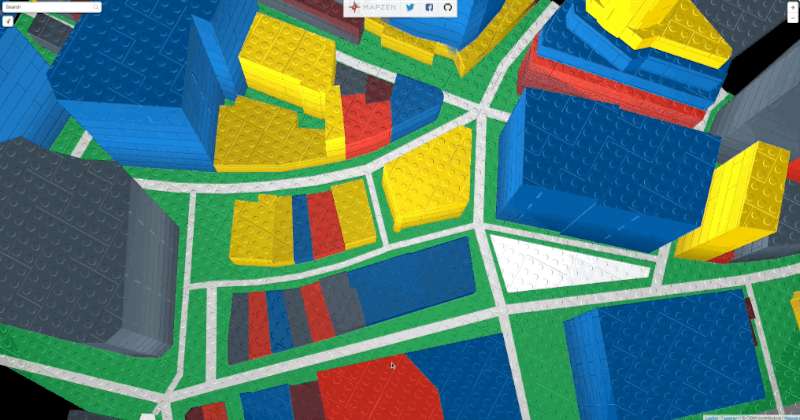
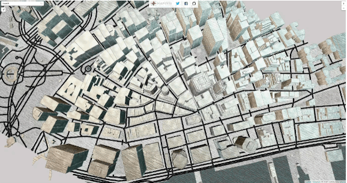

# Tangram Sandbox

Experiments with [Tangram.js](https://github.com/tangrams/tangram) styles by [Patricio Gonzalez Vivo](https://twitter.com/patriciogv) at [Mapzen](https://mapzen.com/).

#### Materials & Procedural Textures

#### Materials & Textures (procedural and files) & Filter

#### Materials & Lights

#### Materials & Textures (procedural and files)

