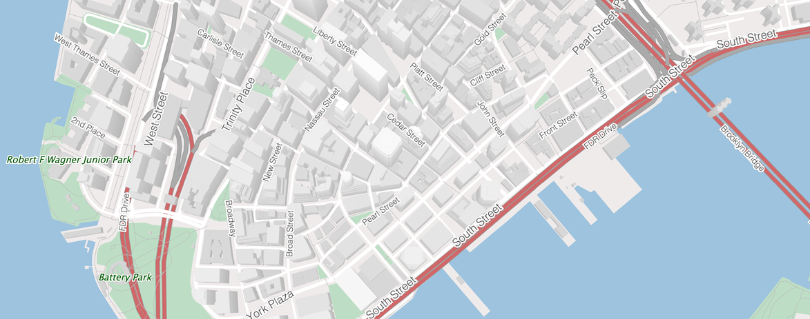

# Tangram

**Tangram** is a JavaScript library for rendering 2D & 3D maps live in a web browser with WebGL. It is tuned for OpenStreetMap but supports any source of GeoJSON/TopoJSON or binary vector data, including tile sets and single files.

https://github.com/tangrams/tangram