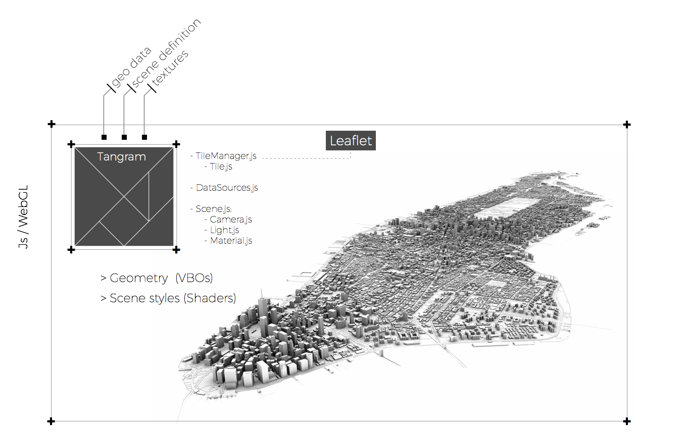

# Tangram

**Tangram** is a JavaScript library for rendering 2D & 3D maps live in a web browser with WebGL. It is tuned for OpenStreetMap but supports any source of GeoJSON/TopoJSON or binary vector data, including tile sets and single files.

[Source: https://github.com/tangrams/tangram](https://github.com/tangrams/tangram)

[Documentation: https://mapzen.com/documentation/tangram](https://mapzen.com/documentation/tangram)

**+** [more information about the yaml scene files](https://mapzen.com/documentation/tangram/Scene-file/)