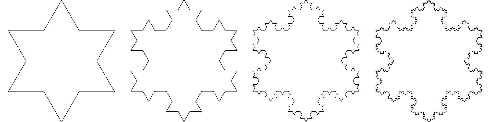

How to display a world with infinit level of precision 



Dividing and conquering it into tiles


Tiles, tiles, tiles

```yaml
sources:
    osm:
        type: TopoJSON
        url:  //vector.mapzen.com/osm/all/{z}/{x}/{y}.topojson
 ```