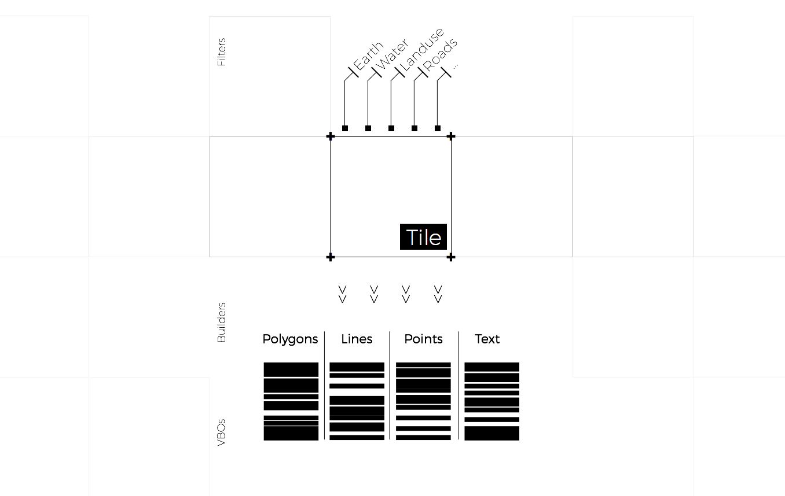

<!-- .slide: data-background="#ffff" -->

Layers



**+** [more information about the different styles](https://mapzen.com/documentation/tangram/Styles-Overview/)


```yaml
sources:
    osmTile:
        type: GeoJSON
        url: //vector.mapzen.com/osm/all/16/19293/24640.json
layers:
    water:
        data: { source: osmTile }
        draw:
            polygons:
                ...
    earth:
        data: { source: osmTile }
        draw:
            polygons:
                ...
    landuse:
        data: { source: osmTile }
        draw:
            polygons:
                ...
    places:
        data: { source: osm }
        draw:
            text:
                font:
                	...
            points:
            	...
    roads:
        data: { source: osmTile }
        draw:
            lines:
                ...
            text:
            	font:
            		...
    buildings:
        data: { source: osmTile }
        draw:
            polygons:
            	extride: true
                ...
```

[**+** more information about filtering layers on Tangram](https://mapzen.com/documentation/tangram/Filters-Overview/)