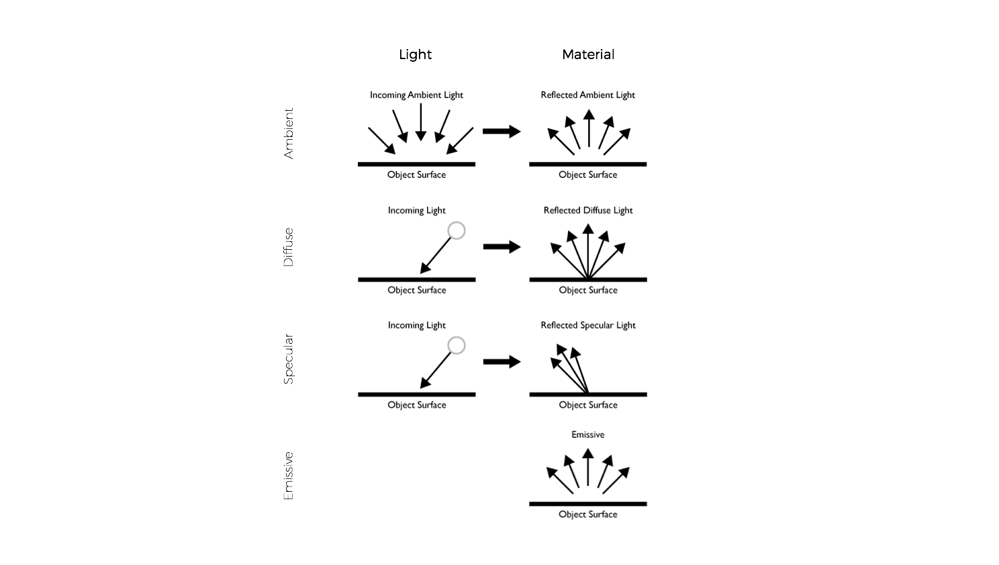

<!-- .slide: data-background="#ffff" -->
### [Polygon/Lines main **Fragment** Shader](https://github.com/tangrams/tangram/blob/master/src/styles/polygons/polygons_fragment.glsl)

```
uniform vec2 u_resolution;
uniform float u_time;
uniform vec3 u_map_position;
uniform vec3 u_tile_origin;
uniform float u_meters_per_pixel;
uniform float u_device_pixel_ratio;

varying vec4 v_position;
varying vec3 v_normal;
varying vec4 v_color;
varying vec4 v_world_position;

#ifdef TANGRAM_TEXTURE_COORDS
    varying vec2 v_texcoord;
#endif

#if defined(TANGRAM_LIGHTING_VERTEX)
    varying vec4 v_lighting;
#endif

#pragma tangram: camera
#pragma tangram: material
#pragma tangram: lighting
#pragma tangram: global

void main (void) {
    vec4 color = v_color;
    vec3 normal = v_normal;

    #ifdef TANGRAM_MATERIAL_NORMAL_TEXTURE
        calculateNormal(normal);
    #endif

    // Modify normal before lighting
    #pragma tangram: normal

    // Modify color and material properties before lighting
    #if !defined(TANGRAM_LIGHTING_VERTEX)
    #pragma tangram: color
    #endif

    #if defined(TANGRAM_LIGHTING_FRAGMENT)
        color = calculateLighting(v_position.xyz - u_eye, normal, color);
    #elif defined(TANGRAM_LIGHTING_VERTEX)
        color = v_lighting;
    #endif

    // Modify color after lighting (filter-like effects that don't require a additional render passes)
    #pragma tangram: filter

    gl_FragColor = color;
}
```
[Note the injection points defined through ```pragmas```](https://github.com/tangrams/tangram/tree/master/src/gl/shaders)


[**Material**.js - **Light**.js properties](https://github.com/tangrams/tangram/blob/master/src/gl/shaders/)




How it works?


Seting up your **lights**
```yaml
lights:
    light1:
        type: directional
        direction: [0, 1, -.5]
        diffuse: .6
        ambient: .3
    point:
        type: point
        position: [-500px, 200px, 500px]
        origin: ground
        diffuse: .35
        ambient: .1
        radius: 1000px
```
**+** [more information about lights in tangram](https://mapzen.com/documentation/tangram/Lights-Overview/)


Seting up your **materials**
```
styles:
    ocean:
        base: polygons
        material:
            ambient: .7
            diffuse:
                texture: imgs/sem-sky-0001.jpg
                mapping: spheremap
    sand:
        base: polygons
        material:
            normal:
                texture: imgs/normal-0015.jpg
                mapping: planar
                scale: 0.01
            ambient: 0.8
            diffuse: 1
            specular: 0
```
**+** [more information about materials in tangram](https://mapzen.com/documentation/tangram/Materials-Overview/)


Assigning this styles to **layers**
```yaml
layers:
    earth:
        data: { source: osm }
        draw:
            sand:
                order: 0
                color: [0.933,0.890,0.839]
    water:
        data: { source: osm }
        draw:
            ocean:
                order: 1
                color: [0.533, 0.733, 0.933]
```


Let's see it all working together
[click here](http://tangrams.github.io/tangram-play/?scene=https://raw.githubusercontent.com/tangrams/tangram-sandbox/gh-pages/styles/sandbox.yaml)