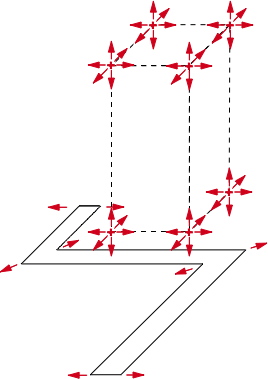
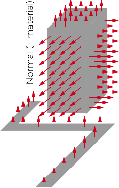
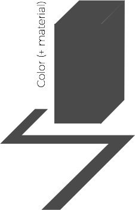
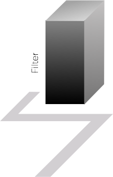

<!-- .slide: data-background="#ffff" -->

*But there is more*?

For the same price you can get users to inject their own **GLSL blocks** of code into the **vertex** and **fragment** shaders.


[Polygon/Lines main **Vertex** Shader](https://github.com/tangrams/tangram/blob/master/src/styles/polygons/polygons_vertex.glsl)

```
uniform vec2 u_resolution;
uniform float u_time;
uniform vec3 u_map_position;
uniform vec3 u_tile_origin;
uniform float u_meters_per_pixel;
uniform float u_device_pixel_ratio;

uniform mat4 u_model;
uniform mat4 u_modelView;
uniform mat3 u_normalMatrix;

attribute vec4 modelPosition();
attribute vec4 a_color;

// Optional normal attribute, otherwise default to up
#ifdef TANGRAM_NORMAL_ATTRIBUTE
    attribute vec3 a_normal;
    #define TANGRAM_NORMAL a_normal
#else
    #define TANGRAM_NORMAL vec3(0., 0., 1.)
#endif

// Optional dynamic line extrusion
#ifdef TANGRAM_EXTRUDE_LINES
    // xy: extrusion direction in xy plane
    // z:  half-width of line (amount to extrude)
    // w:  scaling factor for interpolating width between zooms
    attribute vec4 a_extrude;
#endif

varying vec4 v_position;
varying vec3 worldNormal();
varying vec4 v_color;
varying vec4 worldPosition();

// Optional texture UVs
#ifdef TANGRAM_TEXTURE_COORDS
    attribute vec2 a_texcoord;
    varying vec2 v_texcoord;
#endif

#if defined(TANGRAM_LIGHTING_VERTEX)
    varying vec4 v_lighting;
#endif

#pragma tangram: camera
#pragma tangram: material
#pragma tangram: lighting
#pragma tangram: global

void main() {
    // Adds vertex shader support for feature selection
    #pragma tangram: feature-selection-vertex

    // Texture UVs
    #ifdef TANGRAM_TEXTURE_COORDS
        v_texcoord = a_texcoord;
    #endif

    // Position
    vec4 position = vec4(SHORT(modelPosition().xyz), 1.);

    #ifdef TANGRAM_EXTRUDE_LINES
        vec2 extrude = SCALE_8(a_extrude.xy);
        float width = SHORT(a_extrude.z);
        float scale = SCALE_8(a_extrude.w);

        // Keep line width constant in screen-space
        float zscale = u_tile_origin.z - u_map_position.z;
        width *= pow(2., zscale);

        // Smoothly interpolate line width between zooms
        width = mix(width, width * scale, -zscale);

        // Modify line width before extrusion
        #pragma tangram: width

        position.xy += extrude * width;
    #endif

    // World coordinates for 3d procedural textures
    worldPosition() = wrapWorldPosition(u_model * position);

    // Adjust for tile and view position
    position = u_modelView * position;

    // Modify position before camera projection
    #pragma tangram: position

    // Setup varyings
    v_position = position;
    worldNormal() = normalize(u_normalMatrix * TANGRAM_NORMAL);
    v_color = a_color;

    // Vertex lighting
    #if defined(TANGRAM_LIGHTING_VERTEX)
        vec4 color = a_color;
        vec3 normal = TANGRAM_NORMAL;

        // Modify normal before lighting
        #pragma tangram: normal

        // Modify color and material properties before lighting
        #pragma tangram: color

        v_lighting = calculateLighting(position.xyz, normal, color);
        v_color = color;
    #endif

    // Camera
    cameraProjection(position);
    applyLayerOrder(SHORT(modelPosition().w), position);

    gl_Position = position;
}
```
[Note the injection points defined through ```pragmas```](https://github.com/tangrams/tangram/tree/master/src/gl/shaders)


[Polygon/Lines main **Fragment** Shader](https://github.com/tangrams/tangram/blob/master/src/styles/polygons/polygons_fragment.glsl)

```
uniform vec2 u_resolution;
uniform float u_time;
uniform vec3 u_map_position;
uniform vec3 u_tile_origin;
uniform float u_meters_per_pixel;
uniform float u_device_pixel_ratio;

varying vec4 v_position;
varying vec3 worldNormal();
varying vec4 v_color;
varying vec4 worldPosition();

#ifdef TANGRAM_TEXTURE_COORDS
    varying vec2 v_texcoord;
#endif

#if defined(TANGRAM_LIGHTING_VERTEX)
    varying vec4 v_lighting;
#endif

#pragma tangram: camera
#pragma tangram: material
#pragma tangram: lighting
#pragma tangram: global

void main (void) {
    vec4 color = v_color;
    vec3 normal = worldNormal();

    #ifdef TANGRAM_MATERIAL_NORMAL_TEXTURE
        calculateNormal(normal);
    #endif

    // Modify normal before lighting
    #pragma tangram: normal

    // Modify color and material properties before lighting
    #if !defined(TANGRAM_LIGHTING_VERTEX)
    #pragma tangram: color
    #endif

    #if defined(TANGRAM_LIGHTING_FRAGMENT)
        color = calculateLighting(v_position.xyz - u_eye, normal, color);
    #elif defined(TANGRAM_LIGHTING_VERTEX)
        color = v_lighting;
    #endif

    // Modify color after lighting (filter-like effects that don't require a additional render passes)
    #pragma tangram: filter

    gl_FragColor = color;
}
```
[Note the injection points defined through ```pragmas```](https://github.com/tangrams/tangram/tree/master/src/gl/shaders)


What kind of **shaders blocks** can we inject?


Position & width




```yaml
styles:
    geometry-dynamic-height:
        mix: functions-map
        shaders:
            defines:
                ZOOM_START: 15.0
                ZOOM_END: 20.0
                ZOOM_LINEAR_FACTOR: 2.0
            blocks:
                position: |
                    float zoom = map(u_map_position.z,ZOOM_START,ZOOM_END,1.,0.);
                    position.z *= max(1.,.5+ZOOM_LINEAR_FACTOR*zoom);
    geometry-dynamic-width:
        shaders:
            blocks:
                width: |
                    width *= 0.2+min(pow(position.z*0.006,2.),.6);
```
**+** [see example](http://tangrams.github.io/tangram-play/?scene=https://rawgit.com/tangrams/tangram-sandbox/gh-pages/styles/blueprint.yaml&lines=185-200#17/40.71208/-74.01771)


Normals




```yaml
    ocean:
        base: polygons
        ...
        material:
            ambient: .7
            diffuse:
                texture: imgs/sem-sky-0001.jpg
                mapping: spheremap
        shaders:
            blocks:
                normal: |
                    normal += snoise(vec3(worldPosition().xy*0.08,u_time*.5))*0.02;
```
**+** [see example](http://tangrams.github.io/tangram-play/?scene=https://rawgit.com/tangrams/tangram-sandbox/gh-pages/styles/sandbox.yaml&lines=75-86#16.29625000000001/40.70147/-74.01192)


```yaml
    floor:
        base: polygons
        ...
        shaders:
            blocks:
                normal: |
                    vec2 st = fract(worldPosition().xy*0.0175);
                    normal = legoPattern(st);
                    st = tile(st,2.);
                    vec2 pos = st-0.5;
                    float a = atan(pos.y,pos.x);
                    normal += vec3(cos(a),sin(a),0.)*circle(st,0.4);
                    normal *= 1.0-circle(st,0.26);
                    normal.b = 1.0;
```
**+** [see example](http://tangrams.github.io/tangram-play/?scene=https://rawgit.com/tangrams/tangram-sandbox/gh-pages/styles/lego.yaml&lines=67-80#18/40.70147/-74.01192)


Color




```yaml
    buildings:
        base: polygons
        mix: patterns
        texcoords: true
        shaders:
            blocks:
                color: |
                    vec2 st = vec2(v_texcoord.x,worldPosition().z*0.01);
                    float b = 0.1+random(getBrightness(color.rgb))*.9;
                    float pattern = 0.0;
                    if (b > 0.9){
                        if( dot(worldNormal(),vec3(0.,0.,1.)) >= 0.9 ){
                            st = fract(worldPosition().xy*0.1);
                        } else {
                            st = tile(st,3.);
                        }
                        pattern = circle(st,0.2);
                    } else if (b > 0.8){
                        if( dot(worldNormal(),vec3(0.,0.,1.)) >= 0.9 ){
                            st = fract(worldPosition().xy*0.05);
                            st = brickTile(st,2.);
                        } else {
                            st = brickTile(st,5.);
                        }
                        pattern = 1.0-circle(st,0.1);
                    } else {
                        if( dot(worldNormal(),vec3(0.,0.,1.)) >= 0.9 ){
                            st = v_texcoord.xy;
                        } else {
                            st *= 0.5;
                        }
                        float gradient = floor(b*10.)*0.1;
                        float angle = 3.1415 * gradient;
                        pattern = stripes(st,angle,gradient);
                    }
                    color.rgb = mix(vec3(0.204,0.204,0.204),vec3(1.000,0.968,0.908),pattern);
```
**+** [see example](http://tangrams.github.io/tangram-play/?scene=https://rawgit.com/tangrams/tangram-sandbox/gh-pages/styles/patterns.yaml&lines=98-135#18/40.70147/-74.01192)


Filter




```yaml
    filter-grain:
        mix: generative-fbm
        shaders:
            defines:
                ...
            blocks:
                global: |
                    ...
                filter: |
                    // Apply the grain in the amount defined on GRAIN_AMOUNT
                    color.rgb -= grain()*GRAIN_AMOUNT;
```
**+** [see example](http://tangrams.github.io/tangram-play/?scene=https://rawgit.com/tangrams/tangram-sandbox/gh-pages/styles/grain.yaml&lines=169-190#18/40.70147/-74.01192)